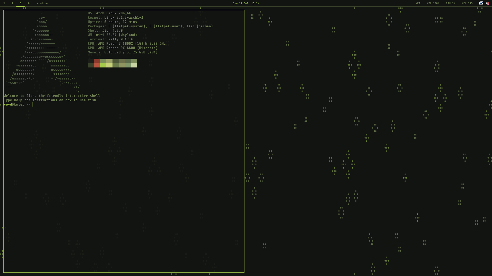
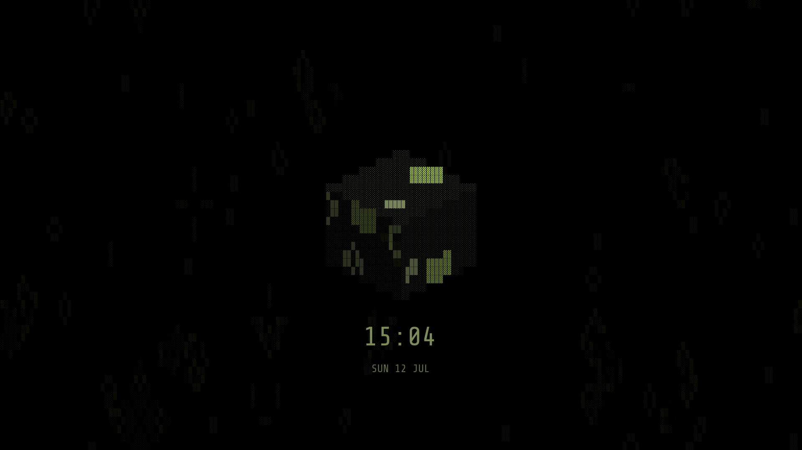
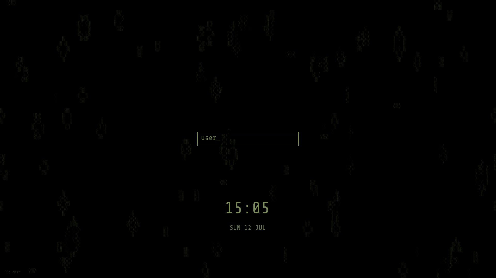
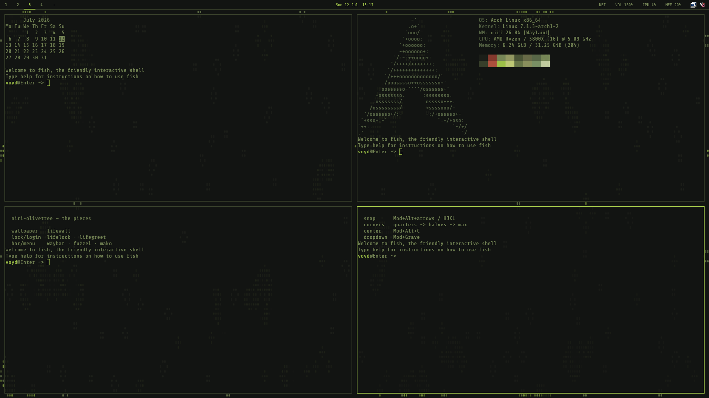
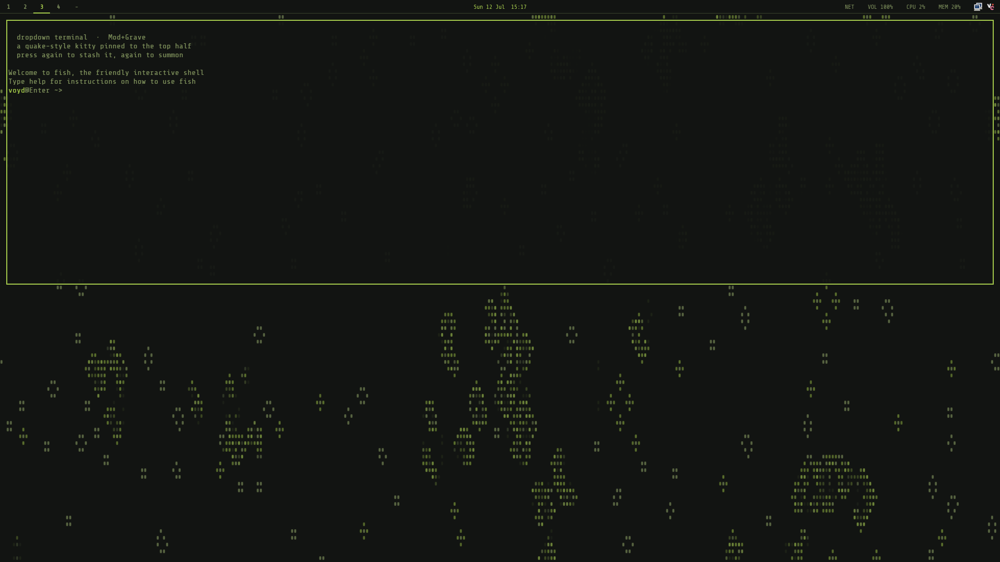
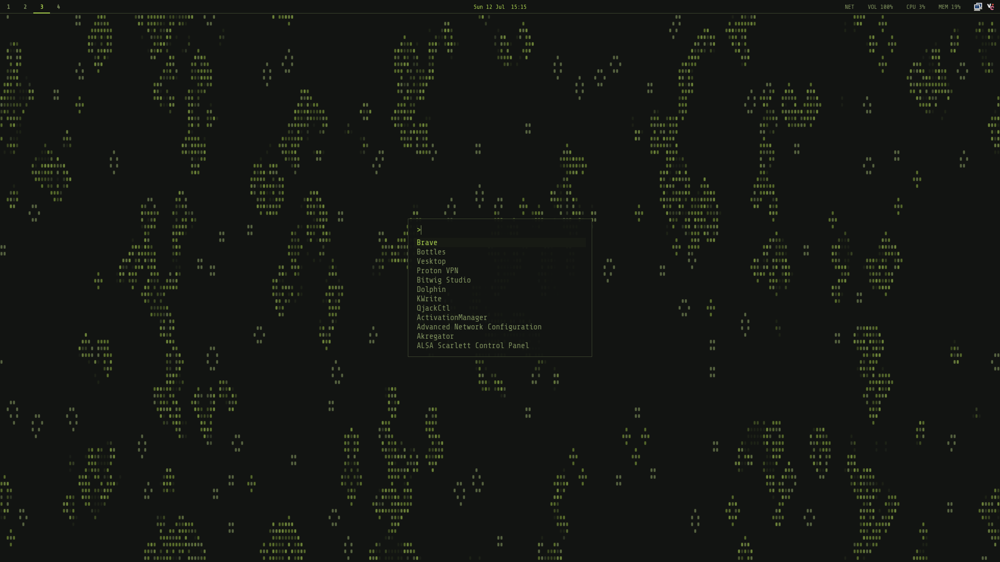
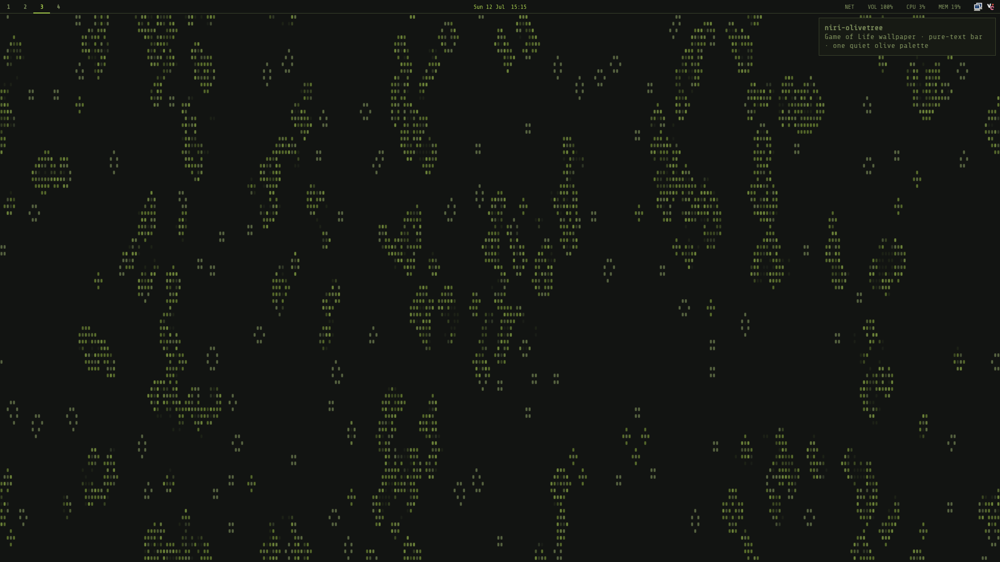
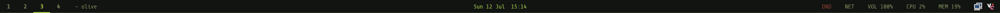

# niri-olivetree 🫒

A minimal, muted, olive-green rice for the [niri](https://yalter.github.io/niri/)
scrollable-tiling Wayland compositor — with a live **Conway's Game of Life
wallpaper**, a matching **Game of Life lock screen and login greeter**, and the
whole desktop (bar, launcher, notifications, terminal, GTK/Qt apps) pulled onto
one quiet palette.

## Screenshots


*At rest: Conway's Game of Life drifting across the moss-black background in
olive `#` glyphs, under the 26 px bar.*


*At work: shell, file manager and [termusic](https://github.com/tramhao/termusic)
in kitty panes, with the colonies ghosting through the 7% transparency.*


*System at a glance: fastfetch over the colonies, everything on the olive palette.*

The rest of the setup:

| | |
|---|---|
|  |  |
| **lifelock** — the isometric Game of Life cube; a keystroke flares a panel lime. | **lifegreet** — the same cube grows out of an olive username box at login. |
|  |  |
| `Mod+Alt+arrows` snap floats to quarters → halves → max, with 12 px gaps. | `Mod+Grave` drops a quake-style kitty into the top half. |
|  |  |
| fuzzel, pure-text, no icons. | mako notifications in the olive panel. |


*The 26 px bar: workspaces · title · clock · DND · NET · VOL · CPU · MEM — labels, no glyphs.*

## Palette

| Role | Hex | |
|---|---|---|
| Background | `#121412` | dark moss-black |
| Panel / surface | `#171a14` | |
| Border / inactive | `#39412b` | dim olive |
| Text | `#7b8c5a` | sage |
| Accent / focus | `#a4c94b` | bright lime-olive |
| Urgent | `#8a3b2e` | rust |

One accent, no gradients, no rounded corners, shadows off. The only thing that
moves is the wallpaper.

## What's in the box

| Piece | What it does |
|---|---|
| `niri/config.kdl` | Full ready-to-run config: olive borders, dimmed unfocused windows, crisp animations, sane binds, floating-window snapping |
| [lifewall](https://github.com/TheWhyteWolf/lifewall) | Conway's Game of Life as the wallpaper — a tiny Rust binary (cloned + built by `install.sh`) rendered through kitty's background panel at 30 fps, births fading in and deaths dissolving. Pause it (zero CPU) with `Mod+Shift+G`, reseed with `Mod+Ctrl+G`. Python fallback if you don't have cargo. |
| [lifelock](https://github.com/TheWhyteWolf/lifegate) + swayidle | Game of Life cube lock screen; auto-lock at 10 min, screens off at 15, locks before sleep. swaylock stays as the `Mod+Shift+Alt+Escape` recovery fallback |
| [lifegreet](https://github.com/TheWhyteWolf/lifegate) + greetd | Matching Game of Life login screen — the cube grows out of an olive username box (optional, separate installer; tuigreet fallback) |
| `waybar/` | Thin 26 px bar, pure-text labels: workspaces, title, clock, DND, network, volume, battery, CPU/MEM. Volume/brightness keys flash a wob OSD |
| `fuzzel/` | Launcher, clipboard history (`Mod+P`) and power menu (`Mod+Shift+E`), all matching |
| `mako/` | Olive notifications; do-not-disturb via `Mod+N` |
| `kitty/` | `rice.conf` (transparency + font, wired in automatically) and `olive.conf` (full olive colour theme, on by default) |
| `qt6ct/`, `xdg/`, GTK | Dark theme routing so Qt and GTK apps don't flashbang you |

Font: [ShureTechMono Nerd Font](https://www.nerdfonts.com/) everywhere (Cousine
kept as the install fallback).
Cursor: [phinger-cursors](https://github.com/phisch/phinger-cursors) (light).

## Install

Arch-based distros (uses `yay`/`paru` if present for the one AUR package):

```sh
git clone https://github.com/TheWhyteWolf/niri-olivetree.git ~/niri-olivetree
bash ~/niri-olivetree/install.sh
```

The script installs packages, backs up any existing configs to `*.bak`,
symlinks these configs into `~/.config`, clones and builds the Game of Life
binaries (the [lifewall](https://github.com/TheWhyteWolf/lifewall) wallpaper and
the [lifelock](https://github.com/TheWhyteWolf/lifegate) locker) from their
repos, installs lifelock's PAM file, sets the GTK dark theme + cursor, and runs
`niri validate`. Then log out and pick **Niri** at the login screen.

On other distros: install the equivalents of the package list at the top of
`install.sh`, then run the script — the symlink/build steps are distro-agnostic
(package step will just fail past pacman; comment it out).

### The login screen (optional, deliberate)

Replaces your display manager with greetd + **lifegreet** — the Game of Life
cube greeter that matches the lock screen (built from the
[lifegate](https://github.com/TheWhyteWolf/lifegate) repo). You type your
username into a bare olive box, Enter grows the cube, and the password shows
nothing but panel flares.

```sh
bash ~/niri-olivetree/greeter-install.sh
```

It builds lifegreet, installs the greetd config plus a memlock service drop-in,
backs up any existing greetd config, and prints the rollback command when done.
Cut over by rebooting. [tuigreet](https://github.com/apognu/tuigreet) stays
installed as the fallback (`greetd/config-tuigreet.toml`).

## Keys worth knowing

| Bind | Action |
|---|---|
| `Mod+Space` / `Mod+Return` / `Mod+D` | Launcher (fuzzel) |
| `Mod+T` | Terminal (kitty) |
| `Mod+Grave` | Dropdown terminal (quake-style kitty in the top half) |
| `Mod+P` | Clipboard history |
| `Mod+N` | Do-not-disturb toggle |
| `Mod+Shift+E` | Power menu (lock / suspend / logout / reboot / poweroff) |
| `Mod+Alt+Escape` | Lock (lifelock) |
| `Mod+Alt+arrows` / `H/J/K/L` | Float snap: halves → quarters → max; back toward the middle restores |
| `Mod+Alt+C` / `Mod+Alt+R` | Center / un-snap floating window |
| `Mod+Shift+Ctrl+arrows` | Nudge floating window 40 px |
| `Mod+Shift+G` / `Mod+Ctrl+G` | Pause / reseed the Game of Life wallpaper |
| `Mod+O` | Overview |
| `Mod+Shift+/` | Full hotkey overlay |

Everything else follows niri's standard scheme — arrows/HJKL to focus,
`+Ctrl` to move, numbers for workspaces, `Print` to screenshot. It's all in
[`niri/config.kdl`](niri/config.kdl), which is commented for tweaking.

### Floating windows

`Mod+V` floats the focused window; then `Mod+Alt+arrows` (or `H/J/K/L`) snap it
Windows-style (`scripts/float-snap.sh`): a first press takes a half, a second
along the other axis refines to a corner quarter, `Mod+Alt+Up` from the top
half maximizes — always with a 12 px margin matching the gaps. Pressing back
toward the middle steps out and finally **restores the pre-snap geometry**;
tiled windows auto-float on the first snap and return to tiling on restore.
`Mod+Alt+C` centers, `Mod+Alt+R` un-snaps, `Mod+Shift+Ctrl+arrows` nudge, and
`Mod+drag` / `Mod+right-drag` move / resize with the mouse (niri built-in).
`Mod+Grave` toggles a quake-style dropdown kitty pinned to the top half
(`scripts/scratch-term.sh`). Firefox picture-in-picture docks bottom-right, and
pavucontrol / blueman / nm-connection-editor open floating at a sane size.
These need `jq` (in the package list).

## The wallpaper

[`lifewall`](https://github.com/TheWhyteWolf/lifewall) is a ~400 KB
dependency-free Rust binary that runs Conway's Game of Life on a torus and
interpolates every cell's colour each frame. When the board settles into still
lifes for ~20 s it crossfades into a fresh random soup. It rides inside
`kitten panel --edge=background`, so it behaves like any other layer-shell
wallpaper. Terminals are 7% transparent so the life ghosts through them.

Tick rate, colours, density and glyph are all flags — see the
[lifewall repo](https://github.com/TheWhyteWolf/lifewall), or preview it in any
terminal by just running `lifebg`.

## Uninstall

Configs are symlinks into this repo — delete the links (your originals are
next to them as `*.bak`) and remove the repo. The greeter rolls back with
`sudo systemctl disable greetd && sudo systemctl enable <your-old-dm>`.

## License

[MIT](LICENSE)
